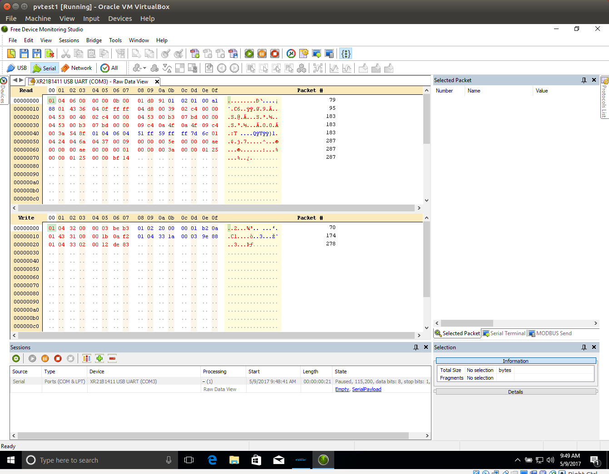

== gotracer Library

Go package to communicate with the EPsolar/EPever Tracer series solar charge controller using the
Modbus RTU protocol.

It has been tested with the EPsolar Tracer4215BN and Tracer2210A solar charge controller
connected to a computer using the EPsolar
link:https://www.amazon.com/gp/product/B016RU8JUY/ref=oh_aui_detailpage_o09_s00?ie=UTF8&psc=1[RS485 to USB]
converter.

The EPsolar RS485 to USB converter appears to use the Exar UART chip
link:https://www.exar.com/content/document.ashx?id=20394&languageid=1033&type=Datasheet&partnumber=XR21B1411&filename=XR21B1411.pdf&part=XR21B1411[XR21B1411]. 

== OS support for the Epsolar RS485 to USB converter

=== Ubuntu 16.04 (xenial)

The default Ubuntu Exar device driver does not enable the RS485 mode:

https://unix.stackexchange.com/questions/239839/how-to-set-a-serial-port-to-rs-485-mode

NOTE: The 'gotracer' example program provided below will hang if used with the default Ubuntu Exar device
driver.

A patched version is available at:

https://github.com/kasbert/epsolar-tracer/tree/master/xr_usb_serial_common-1a

(this patch was possible because of information from Exar support)

Installation steps for the patched device driver:

----
$ lsusb |grep Exar # verify that RS485 - USB converter has been detected correctly
Bus 001 Device 012: ID 04e2:1411 Exar Corp.
$ git clone https://github.com/kasbert/epsolar-tracer.git
$ sudo bash
# cd epsolar-tracer/xr_usb_serial_common-1a
# make modules_install  # compile and install the new Exar kernel module
# rmmod cdc-acm # unload the existing Exar kernel module 
# modprobe -r usbserial
# modprobe usbserial
# lsmod |grep xr_usb xr_usb_serial_common    40960  0
# modprobe -r xr_usb_serial_common
# insmod ./xr_usb_serial_common.ko # load the new Exar kernel module
----

=== Raspbian 8.0 (jessie)

Raspbian requires setup of the environment to compile kernel modules:

----
# sudo bash
# apt-get install raspberrypi-kernel-headers build-essential
----

Remaining installation steps are the same as for Ubuntu. 

=== Windows 10

The Exar driver is included in the
link:http://www.epsolarpv.com/en/index.php/Technical/download[EPsolar Solar Station Monitor]
software package.

RS485 mode is enable by default.

== Modbus protocol

The EPsolar Tracer series of solar charge controllers use the Modbus RTU protocol variant (binary data).

Latest EPsolar Modbus protocol specification:

https://github.com/kasbert/epsolar-tracer/blob/master/archive/ControllerProtocolV2.3.pdf

General information about the Modbus protocol:

https://en.wikipedia.org/wiki/Modbus

http://www.chipkin.com/files/liz/MODBUS_2010Nov12.pdf

Example:

Tracer Modbus request:

----
[]byte{0x01, 0x04, 0x32, 0x00, 0x00, 0x03, 0xbe, 0xb3}
----

|===
| *Value* | *Description*
| 0x01 | station address (depending on solar charge controller configuration) 
| 0x04 | standard modbus function code 'read input register' 
| 0x3200 | realtime data start register (mainly statistics) 
| 0x0003 | number of registers to read (16 bit)
| 0xbeb3 | CRC-16-ANSI check sum
|===

Tracer Modbus response:

|===
| *Value* | *Description*
| 0x01 | station address (depending on solar charge controller configuration) 
| 0x04 | standard modbus function code 'read input register' 
| 0x06 | number of register byte values to follow 
| 0x0000 | battery status (16 bit) 
| 0x000b | charging equip. status (16 bit) 
| 0x0001 | discharge equip. status (16 bit) 
| 0xd091 | CRC-16-ANSI check sum 
|===

The full set of Modbus requests supported by the 'gotracer' library is identical to the Modbus
requests issued by the EPsolar Station Monitor software:

The screenshot shows a Modbus trace for one gotracer.Status() request (create with the Windows link:https://freeserialanalyzer.com/features[device monitoring studio](similar to wireshark)). 

== Example

This example program reads the 'real time' data from the EPSolar Tracer and displays in on the screen.

NOTE: /dev/ttyXRUSB0 is the typical Exar device name used on Ubuntu/Raspbian. Windows use different
device names (for example: COM3).

test.go:

----

package main

import (
	"fmt"
	"log"
	"github.com/spagettikod/gotracer"
)

func main() {
	status, err := gotracer.Status("/dev/ttyXRUSB0")
	if err != nil {
		log.Fatal(err)
	}
	fmt.Println(status)
}

----

Run the program:

----
$ go run ./test.go
ArrayVoltage: 14.56
ArrayCurrent: 5.10
ArrayPower: 74.30
BatteryVoltage: 11.61
BatteryCurrent: 4.05
BatterySOC: 79%
BatteryTemp: 25.00
BatteryMaxVoltage: 11.72
BatteryMinVoltage: 10.39
DeviceTemp: 31.41
LoadVoltage: 11.61
LoadCurrent: 3.89
LoadPower: 45.16
Load: true
EnergyConsumedDaily: 0.26
EnergyConsumedMonthly: 4.29
EnergyConsumedAnnual:5.09
EnergyConsumedTotal:5.09
EnergyGeneratedDaily: 0.35
EnergyGeneratedMonthly: 4.30
EnergyGeneratedAnnual: 6.65
EnergyGeneratedTotal: 6.65
----

== Roadmap

* Add missing status information: PV Working State, Charging State, Battery State and Controller
Working State
* Turn load on and off
* Read device information: model, software version and serial number
* Read device parameters
* Set device parameters
* Read device time
* Set device time
